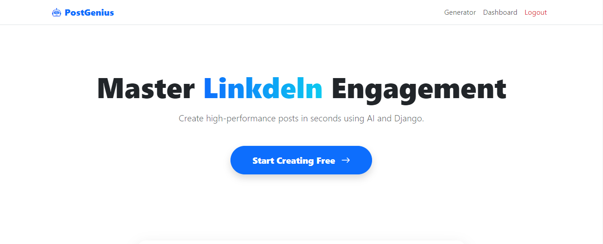
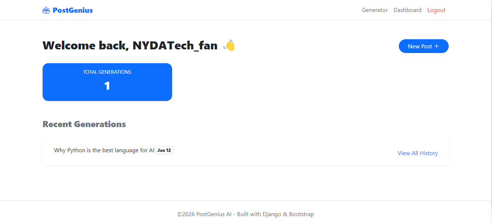
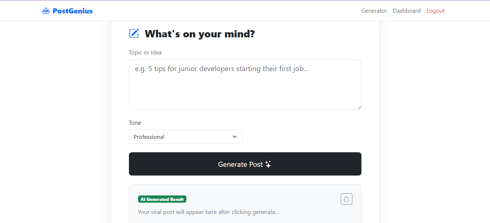
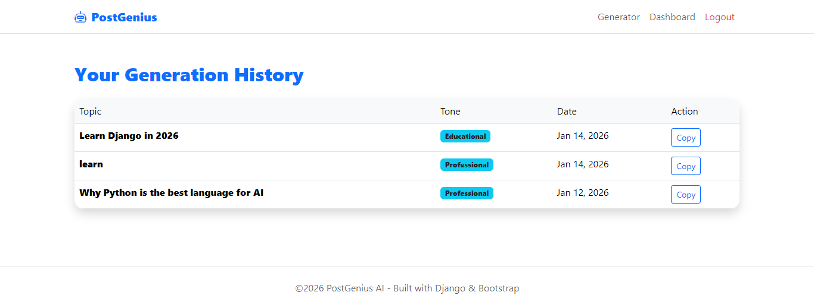

# 🚀 PostGenius AI - Viral Content SaaS

PostGenius is a full-stack Django application that uses OpenAI's GPT-3.5/4 models to generate viral LinkedIn and social media posts based on user topics and tones.

## ✨ Features
- **AI-Powered Generation:** Custom prompts for different professional tones.
- **Secure Authentication:** User registration, login, and protected routes.
- **Personal Dashboard:** Track your generation stats and history.
- **Modern UI:** Built with Bootstrap 5 for a clean, responsive experience.

## 📸 Screenshots





## 🛠️ Tech Stack
- **Backend:** Python / Django
- **Frontend:** Bootstrap 5 / HTML / CSS
- **AI:** OpenAI API
- **Database:** SQLite (Development)

## ⚙️ Local Setup
1. Clone the repo: `git clone [your-repo-link]`
2. Install dependencies: `pip install -r requirements.txt`
3. Create a `.env` file in the root:
   ```env
   OPENAI_API_KEY=your_api_key_here

   SECRET_KEY=your_django_secret_key
